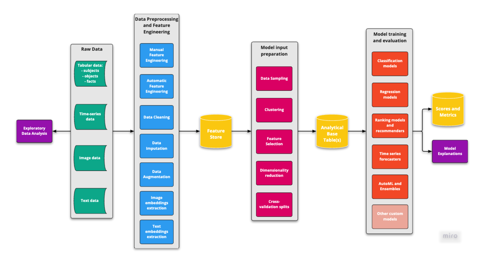
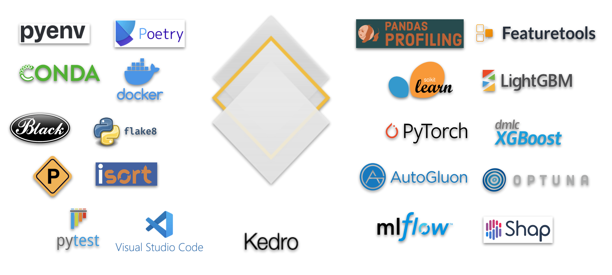

# GetInData ML Framework

GetInData Machine Learning Framework is a set of complete blueprints for solving typical machine learning problems. It leverages best-in-class open source technologies and materializes best practices for structuring and developing machine learning solutions.

## Contents

- [Overview](#overview)
- [Use cases](#usecases)
- [Technologies](#technologies)
- [How to start](#howtostart)
    - [Creating a new project](#howtostart-new)
    - [Running existing project locally](#howtostart-local)
        - [Recommended way using VSCode and Dev Containers](#howtostart-local-vsc)
        - [Alternative ways of manual environment creation](#howtostart-local-alt)
        - [Remarks on some technologies/operating systems](#howtostart-local-remarks)
    - [Running existing project on GCP (VertexAI)](#howtostart-gcp)
    - [Running existing project on other full-scale environments](#howtostart-other)
- [Working with GID ML Framework](#wayofwork)

## Overview 

A brief summary of why GID ML Framework was brought to life:
- to decrease time-to-market by enabling faster PoCs
- to share best practices for developing ML products
- to organize and standardize Way-of-Work for data scientists

To achieve the above goals, we do not aim to create any ML platform or any specific code package. On the other hand, we also do not want to only share theoretical insights about way-of-work or describe our project experience. Instead, we are creating a **library of solved machine learning use cases that implement ML code development best practices using modern open-source technology stack.** Some of the most important features tha our GID ML Framework provides are:
- Transferable environments (local/cloud)
- Production quality code from the start
- Well-organized configuration
- Careful dependency management
- Experiment tracking and model versioning
- Node/pipeline-based modular workflow that is fully reproducible and reusable
- Comprehensive documentation and test coverage
- Predefined, standard use cases (blueprints)

Apart from materializing best development practices and standardizing problem solving approach, the motivation for creating GID ML Framework results from observation, that many business problems that are solved using machine learning can be described as an interconnected collection of repeatable building blocks. If you pre-define and implement those building blocks on some real-life examples and do so in a well-structured modular way, those elements will become easily reusable in different, similar use cases that you may encounter. Reusing existing building blocks with a minimum modifications should make **prototyping of new solutions much more efficient, and also facilitate creating a well-structured, documented and tested production grade code from the very beginning of the project**.

## Use cases 

GID ML Framework is a set of complete **use cases** that involve:
- a definition of a business problem that is being solved
- a specific machine learning approach to solve this problem
- example datasets to work with

So far the following use cases have been implemented:
- propensity-to-by classification model ([ga4-mlops - TO BE UPDATED](https://gitlab.com/getindata/aa-labs/coe/gid-ml-framework/-/tree/main/ga4-mlops))
- retail recommender system on multimodal data (tabular, images, natural language descriptions) using ranking gradient boosting models ([recommender_ranking - TO BE UPDATED](https://gitlab.com/getindata/aa-labs/coe/gid-ml-framework/-/tree/main/recommender_ranking))
- e-commerce recommender system on sequential data using Graph Neural Networks ([recommender_gnn - TO BE UPDATED](https://gitlab.com/getindata/aa-labs/coe/gid-ml-framework/-/tree/main/recommender_gnn))

More use cases are either in works or in plans.

Existing use cases are implemented in modular, modifiable and extensible way. When creating a new ML solution, example building blocks from other, similar use cases can be used to various extent. In some cases, even small modifications to existing examples can be sufficient to obtain first working prototypes. For example, if the user is facing a problem of predicting churn and plans to approach it using classification algorithms, he can basically take [ga4-mlops - TO BE UPDATED](https://gitlab.com/getindata/aa-labs/coe/gid-ml-framework/-/tree/main/ga4-mlops) as a blueprint, change configuration files to use his datasets, modify data preprocessing code and run the rest of the pipeline as is. Since both the flavor of input data (tables with binary target per observation) and problem solving approach (binary classification) is similar, all automatic feature encoding, data imputation, modeling and model explanation steps should be applicable to this new problem - at least in a first iteration. More about the way of working with GID ML Framework and pre-implemented use cases can be foung in [this section](#wayofwork).

## Technologies 

## How to start 

### Creating a new project 

The best way to create a new project is to use GID ML Framework starter. The repository and instructions can be found [here - TO BE UPDATED](https://gitlab.com/getindata/aa-labs/coe/gid-ml-framework-starter/-/tree/main). After creating a new project, follow the guidelines for existing projects.

### Running existing project locally 

#### Recommended way using VSCode and Dev Containers 

#### Alternative ways of manual environment creation 

#### Remarks on some technologies/operating systems 

- ARM64
- Windows

### Running existing project on GCP (VertexAI) 

### Running existing project on other full-scale environments 

Work on testing other full-scale environments (AWS, Azure, Kubeflow) is in progress.

## Working with GID ML Framework 
