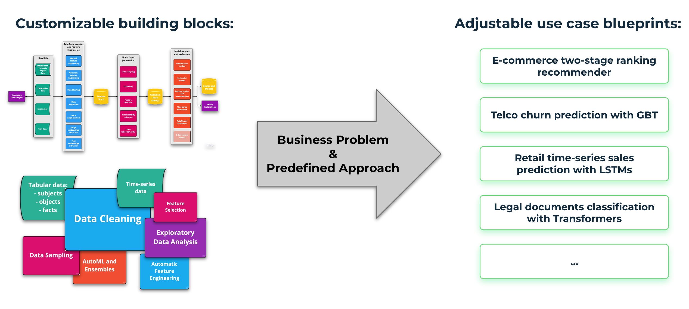
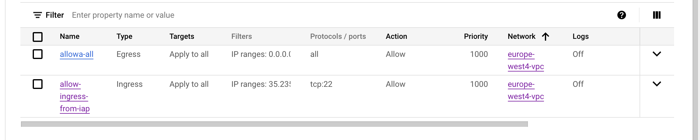
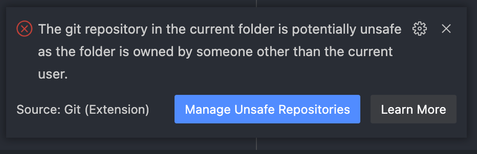

# GetInData ML Framework

GetInData Machine Learning Framework is a set of complete blueprints for solving typical machine learning problems. It leverages best-in-class open source technologies and materializes best practices for structuring and developing machine learning solutions.

By releasing this repo of reusable examples we aim to help data scientists and machine learning engineers to prototype their solutions faster using well-proven tooling and keep the highest quality and maintainability of the code.

## Contents

- [Overview](#overview)
- [Use cases](#usecases)
- [Technologies](#technologies)
- [How to start](#howtostart)
    - [Creating a new project](#howtostart-new)
    - [Running existing project locally](#howtostart-local)
        - [Recommended way using VSCode and Dev Containers](#howtostart-local-vsc)
        - [Remarks on some technologies/setups/operating systems](#howtostart-local-remarks)
        - [Alternative ways of manual environment creation](#howtostart-local-alt)
    - [Running existing project on GCP (VertexAI)](#howtostart-gcp)
    - [Running existing project on other full-scale environments](#howtostart-other)
- [Working with GID ML Framework](#wayofwork)

## Overview <a name="overview"></a>

A brief summary of why GID ML Framework was brought to life:
- to decrease Time-to-Market by enabling faster PoCs
- to share best practices for developing ML products
- to organize and standardize Way-of-Work for data scientists

To achieve the above goals, we do not aim to create any ML platform or any specific code package. On the other hand, we also do not want to only share theoretical insights about way-of-work or describe our project experience. Instead, we are creating a **library of solved machine learning use cases that implement ML code development best practices using modern open-source technology stack.** Some of the most important features tha our GID ML Framework provides are:
- Well-proved open source technology stack
- Transferable environments (local/cloud)
- Production quality code from the start
- Well-organized configuration
- Careful dependency management
- Experiment tracking and model versioning
- Node/pipeline-based modular workflow that is fully reproducible and reusable
- Comprehensive documentation and test coverage
- Predefined, standard use cases (blueprints)

Apart from materializing best development practices and standardizing problem solving approach, the motivation for creating GID ML Framework results from observation, that many business problems that are solved using machine learning can be described as an interconnected collection of repeatable building blocks. If you pre-define and implement those building blocks on some real-life examples and do so in a well-structured modular way, those elements will become easily reusable in different, similar use cases that you may encounter. Reusing existing building blocks with a minimum modifications should make **prototyping of new solutions much more efficient, and also facilitate creating a well-structured, documented and tested production grade code from the very beginning of the project**.


## Use cases <a name="usecases"></a>

GID ML Framework is a set of complete **use cases** that involve:
- a definition of a business problem that is being solved
- a specific machine learning approach to solve this problem
- example datasets to work with

So far the following use cases have been implemented:
- propensity-to-buy classification model on Google Analytics 4 data with additional MLOps components ([ga4-mlops - TO BE UPDATED](https://gitlab.com/getindata/aa-labs/coe/gid-ml-framework/-/tree/main/ga4-mlops))
- retail recommender system on multimodal data (tabular, images, natural language descriptions) using ranking gradient boosting models ([recommender_ranking - TO BE UPDATED](https://gitlab.com/getindata/aa-labs/coe/gid-ml-framework/-/tree/main/recommender_ranking))
- e-commerce recommender system on sequential data using Graph Neural Networks ([recommender_gnn - TO BE UPDATED](https://gitlab.com/getindata/aa-labs/coe/gid-ml-framework/-/tree/main/recommender_gnn))

More use cases are either in works or in plans, including comprehensive time series modeling examples, reinforcement learning, Bayesian models, online ML on data streams and more.

Existing use cases are implemented in modular, modifiable and extensible way. When creating a new ML solution, example building blocks from other, similar use cases can be used to various extent. In some cases, even small modifications to existing examples can be sufficient to obtain first working prototypes. For example, if the user is facing a problem of predicting churn and plans to approach it using classification algorithms, he can basically take [ga4-mlops - TO BE UPDATED](https://gitlab.com/getindata/aa-labs/coe/gid-ml-framework/-/tree/main/ga4-mlops) as a blueprint, change configuration files to use his datasets, modify data preprocessing code and run the rest of the pipeline as is. Since both the flavor of input data (tables with binary target per observation) and problem solving approach (binary classification) is similar, all automatic feature encoding, data imputation, modeling and model explanation steps should be applicable to this new problem - at least in a first iteration. More about the way of working with GID ML Framework and pre-implemented use cases can be foung in [this section](#wayofwork).



Excerpt of what aspects or building blocks can be retrieved and reused from current use cases:
- all:
    - project structure
    - environment setup
    - documentation discipline
    - testing framework
    - configuration arrangement
    - going from small-scale local prototypes to full-scale training in cloud
    - GPU utilization (except `ga4-mlops`)
    - automated hyperparameter optimization (except `recommender_gnn`)
- `ga4-mlops`:
    - training, evaluating and using binary classification models with probability calibration (and after small modification also regresssion or multiclass)
    - propensity-to-buy problem approach
    - batch scoring
    - parameterized SQL-query data retrieval
    - feature encoding
    - missing data imputation
    - predictions explainability
    - [in-development]: data drift and model drift monitoring
    - [in-development]: automated model retraining
    - [in-development]: online scoring on streaming data
    - [in-roadmap]: AutoML packages utilization
- `recommender_ranking`:
    - building two-stage recommendation systems on transactional data with supplementary multimodal data
    - candidate generation
    - extracting embeddings from images
    - extracting embeddings from texts
    - automated exploratory data analysis
    - automated feature engineering
- `recommender_gnn`:
    - building recommendation systems on sequential data
    - using Graph Neural Networks
    - structuring data as graphs
    - modifying blueprints for different datasets
    - building environment using conda instead of pyenv to ensure CUDA support

## Technologies <a name="technologies"></a>

To materialize ML development best practices as concrete working examples we use a modern technology stack. **Our main assumption is to stick to the state of the art, well-proven open source tooling.** We want the GID ML Framework to be applicable and adjustable to any MLOps architecture, so we avoid using commercial or proprietary software for essential functionalities.


Excerpt of the technologies used so far in existing examples:
- [Kedro](https://kedro.org/) which is the very core upon which solution architectures are built. It introduces many essential features like appropriate project structure, modular node/pipeline architecture, well-organized configuration, customizable data catalog with connectors to many data sources, a wide variety of extensions and plugins that allow for integration with other tools and more.
- Visual Studio Code with [Dev Containers](https://code.visualstudio.com/docs/devcontainers/containers) powered by Docker that enable creating encapsulated working environments with all necessary tooling that can be run and used in the same way no matter when they are deployed (access from local IDE to the working environment set up locally or in the cloud)
- [Pyenv](https://github.com/pyenv/pyenv) and [Poetry](https://python-poetry.org/) for Python dependency management
- GetInData Kedro plugins for running Kedro pipelines in different environments ([GCP](https://github.com/getindata/kedro-vertexai), [AWS](https://github.com/getindata/kedro-sagemaker), [Azure](https://github.com/getindata/kedro-azureml), [Kubeflow](https://github.com/getindata/kedro-kubeflow))
- [MLflow](https://mlflow.org/) as an experiment tracker and model repository
- A set of linters and code quality tools ([flake8](https://flake8.pycqa.org/en/latest/), [Black](https://black.readthedocs.io/en/stable/), [isort](https://pycqa.github.io/isort/), [pre-commit](https://pre-commit.com/))
- [Pytest](https://docs.pytest.org/) framework for writing and executing unit/integration tests
- A collection of Python packages for automated exploratory analysis ([Pandas Profiling](https://ydata-profiling.ydata.ai/docs/master/index.html), [Featuretools](https://www.featuretools.com/)), modeling ([LightGBM](https://lightgbm.readthedocs.io/), [PyTorch](https://pytorch.org/) and more), hyperprameter tuning ([Optuna](https://optuna.org/)) and many more

## How to start <a name="howtostart"></a>

### Creating a new project <a name="howtostart-new"></a>

The best way to create a new project is to use GID ML Framework starter. The repository and instructions can be found [here - TO BE UPDATED](https://gitlab.com/getindata/aa-labs/coe/gid-ml-framework-starter/-/tree/main). After creating a new project, follow the guidelines for existing projects.

### Running existing project locally <a name="howtostart-local"></a>

GID ML Framework tries to address the challenge of building reproducible working environments that should be consistent, easy to establish and portable allowing data scientist to create small-scale prototypes locally and then seamlessly move their development to full-scale platforms, either in the cloud (VertexAI, Sagemaker, AzureML) or in on-premises setups (using Kubeflow). We use a combination of Pyenv, Poetry and Docker and leverage Visual Studio Code's Dev Containers to create a recommended development setup, but keeping in mind that there can be always some platform specific nuances (see for example a note from our experience [here](#howtostart-local-remarks)) we leave the freedom of adjusting way-of-work to the specific needs.

#### Recommended way using VSCode and Dev Containers <a name="howtostart-local-vsc"></a>

VSCode's [Remote Development](https://code.visualstudio.com/docs/remote/remote-overview) and [Dev Containers](https://code.visualstudio.com/docs/devcontainers/containers) features brought together create quite unique opportunity to encapsulate your working environment inside a Docker container and connect to it from VSCode IDE no matter where the container is deployed. Following our approach, you can build a working environment just by opening your locally stored project folder inside a container, and later do exactly the same, but this time with the same container built not on your local machine but e.g. on a virtual machine in the cloud. The way you work doesn't change at all - you have your local IDE with all settings and favorite plugins, you just connect to a different backend. All technicalities like re-building the container if you update you working environment or port forwarding for in-project services like [MLflow](https://mlflow.org/) or [Kedro-Viz](https://kedro.readthedocs.io/en/stable/visualisation/kedro-viz_visualisation.html) is handled by VSCode.

The steps to run existing or newly created project are as follows:

1. **Get prerequisites**:
    - [VSCode](https://code.visualstudio.com/) with [Remote Development](https://marketplace.visualstudio.com/items?itemName=ms-vscode-remote.vscode-remote-extensionpack) extension
    - [Docker](https://www.docker.com/) with `/workspaces` entry in `Docker Desktop → Preferences → Resources → File Sharing`

2. Either **create a new project** using our [Kedro starter](https://gitlab.com/getindata/aa-labs/coe/gid-ml-framework-starter) or **clone `gid-ml-framework` repository** and open folder with selected use case in VSCode.

3. If Docker is running, VSCode should should ask to [**"Reopen Folder in a Container"**]((https://code.visualstudio.com/docs/devcontainers/containers#_quick-start-open-an-existing-folder-in-a-container)). You can also bring it up manually by clicking on the blue arrows icon in the bottom-left corner in VSCode.

4. After reopening the project folder in a container, the **Dev Container will be built**. It might take a few minutes at first attempt, later cache should be used if there is a need to rebuild a containers. As you work on the project, you can modify your environment configuration files (e.g. `poetry.toml`, `pyproject.toml`, `Dockerfile`, `devcontainer.json` etc.). You can do it either from inside or outside of the container - changes will be detected and VSCode will suggest to rebuild the container.
 
5. From now on, **you can develop inside the container** and modify and add files the usual way as you do working 100% locally. However, since the container is an isolated environment, you will need to configure git (e.g. SSH keys) and cloud connection (for projects transferrable to cloud) form inside of the container. Before you start, you can run `pytest` command to run tests that will show if everything is set up correctly.

#### Remarks on some technologies/setups/operating systems <a name="howtostart-local-remarks"></a>

##### Running Dev Containers on Apple M1/M2 processors (ARM64 architecture)

Unfortunately, at the moment some of Dev Containers' dependencies do not have native support for Apple Silicon processors. There is an easy way to emulate AMD64 architecture using [QEMU](https://www.qemu.org/) emulator on Mac's with M1/M2 chips. However it has to be noted, that this approach might be not suitable for comfortable development, since executing any command in such emulated environment will be much slower. Our tests showed that while working in Dev Containers on Windows, Linux or Mac with Intel chips all execution times are comparable to respective environments built manually without Dev Containers. On Macs with M1 chips with QEMU emulation, those execution times are over 10x longer.

Currently our suggestion for Mac M1/M2 users is to **build the local working environment manually without Dev Containers for the purpose of active development and then use Dev Containers only to run local tests before moving to the cloud** to ensure the consistency of local setup after that move and minimize the risk of any redevelopment when working already in full-scale.

To run your project inside a Dev Container on local machine with Apple M1/M2 using QEMU you have to add some additional steps before you try to "Reopen folder in a container" ([Step 3 above](#howtostart-local-vsc)):

1.  Install [Rosetta 2](https://support.apple.com/en-gb/HT211861):
```bash
softwareupdate --install-rosetta --agree-to-license
```

2. In `.devcontainer/devcontainer.json` uncomment `RunArgs` related to AMD64 emulation:
```json
	"runArgs": [
		"--init"

		// Uncomment for  emulated ARM64 (Apple M1/M2) support
		,"--platform=linux/amd64"

		// Uncomment to add NVIDIA GPU support
		// ,"--gpus"
		// ,"all"
	],
```

3. In `Dockerfile` add `platform` parameter: 
```dockerfile
# FROM $BASE_IMAGE
# Change the above line for the one below to enable emulated ARM64 (Apple M1/M2) support
FROM --platform=linux/amd64 $BASE_IMAGE
```

4. Rebuild the Dev Container by clicking on bottom-left arrows icon in VSCode and selecting "Rebuild Container"

Presented workaround is based on [this article](https://www.kenmuse.com/blog/forcing-dev-container-to-use-amd64/).

##### Running Dev Containers on Windows

To run Dev Containers on Windows 10/11, it is needed to install Linux distribution within your base OS using [Windows Subsystem for Linux](https://learn.microsoft.com/en-us/windows/wsl/install) feature and configure [Docker Desktop](https://docs.docker.com/desktop/install/windows-install/) to use it. Recommended steps based on [this example](https://docs.docker.com/desktop/windows/wsl/) are:

1. Go to Docker Desktop settings and make sure it is using WSL2 backend:
```
Settings → General → Use WSL 2 based engine
```

2. Then go to the Windows console (e.g. using PowerShell) and set default version of WSL to 2:
```powershell
wsl.exe --set-default-version 2
```

3. Ensure that needed WSL features are enabled:
```powershell
dism.exe /online /enable-feature /featurename:Microsoft-Windows-Subsystem-Linux /all /norestart
dism.exe /online /enable-feature /featurename:VirtualMachinePlatform /all /norestart
```

4. Install Linux subsystem (it can be default Ubuntu):
```
wsl --install -d Ubuntu
```
5. Set installed subsystem as default and restart Docker Desktop if needed:
```
wsl --set-default ubuntu
```

##### Enterprise environments
Our recommended approach to working with transferrable, containerized environments can show the full potential when the user has a decent amount of freedom when interacting with tools, data and infrastructure. We realize that many enterprise setups, especially in big organizations, often come with some limitations in this area. Those limitation can affect for instance:

- installing software of your choice
- downloading data locally from data warehouses
- using user-managed notebooks in cloud
- connecting to remote machines via SSH
- creating project-specific instances of services like MLflow
- forwarding ports or even using open Internet connection and more.

While the philosophy of GID ML Framework's best practices remains unchanged, in corporate setup, all described technical details might need some customization. If you are interested in adjusting technical aspects of out data science way of work to your organization, please check our [Knowledge Base](https://getindata.com/knowledge-base/), [GitHub repository](https://github.com/getindata) of open-source tools and **don't hesitate to [ask for free consultation](https://consultation.getindata.com/mlops-data-platform-streaming-analytics-data-driven) on any data-related topic**.

#### Alternative ways of manual environment creation <a name="howtostart-local-alt"></a>

If for some of the reasons described in previous section it is more convenient to build working environment manually on your local machine instead of using Dev Containers, it is recommended that you follow some steps to preserve consistency between your local manual setup and what you get out of a Dev Container, since you may still want to use it later when you transfer your work to cloud. In short, you need to put together manually some tools that are normally installed in Dev Container when building the Docker image. The list of tools is the same regardless the operating system, however the installation and configuration procedure may vary, therefore below we provide a general procedure of preparing environment manually while the OS-specific details can be found in each tool's documentation that is linked.

The example of creating environment manually is shown for an existing project. If you are starting a new project, first follow the instructions for [setting up a new project using Kedro starter - TO BE UPDATED](https://gitlab.com/getindata/aa-labs/coe/gid-ml-framework-starter/-/blob/main/README.md).

##### Default approach - pyenv and Poetry

The easiest and most lightweight way of creating the environment manually is described below - it features a pyenv/Poetry combo. However, there are some known issues (like [here](https://github.com/python-poetry/poetry/issues/4231) or [here](https://github.com/python-poetry/poetry/issues/4704)) with using Poetry when it comes to CUDA-dependent packages. Please refer to the next section to see recommended workaround, if those issues arise.

1. [Install pyenv](https://github.com/pyenv/pyenv#installation). If you are on Windows, you might consider using [pyenv-win](https://github.com/pyenv-win/pyenv-win)

2. [Install Poetry](https://python-poetry.org/docs/)

3. Add `poetry` and `pyenv` to `PATH` for convenience

4. Install appropriate Python version (for example `3.8.12`) that is specified in `pyproject.toml` using pyenv and set this Python version as global for your system
```bash
pyenv install 3.8.12
pyenv global 3.8.12
```

5. **Go to your project folder** and create virtual environment with Poetry inside your project. **Note that creating a `.venv` inside the project is happening only when working locally, to not mess up your global Python installation**. In Dev Container, dependencies are installed globally, since they are already encapsulated by the container itself.

    - Make Poetry use your pyenv Python installation:
    ``` bash
    poetry env use <path_to_your_pyenv_installation>/.pyenv/versions/3.8.16/bin/python3
    ```

    - **`cd` to your project folder**, then create and activate the virtual environment within:
    ```bash
    python -m venv venv
    source ./venv/bin/activate
    ```

    - Later, keep working with your poetry with standard Poetry commands:
        - `poetry shell` to activate your environment from command line
        - `poetry install` to install dependencies form your `poetry.lock` file
        - `poetry add` to add and install new dependencies
        - `poetry add -D` to add and install dev-only dependencies
        - `poetry lock` to update the `poetry.lock` file

6. From inside your project Poetry environment install `pre-commit` hooks that will help you keep top quality of your code checking it automatically before each commit:
```bash
pre-commit install
```

##### Approach addressing CUDA-related issues - conda and Poetry

As mentioned in the previous section, installing some packages that utilize GPU and CUDA library may cause issues for Poetry, when only a clean pyenv Python installation is used as a basis for Poetry. These problems are related mostly to handling different package distribution channels and the need of compiling CUDA libraries written in C. Unless any of such problems arise it is recommended to proceed with the standard way of creating the environment form previous section (or even more preferably [using Dev Containers](#howtostart-local-vsc)), but if they do arise, one of the ways to mitigate them is to add [conda](https://docs.conda.io/en/latest/) to the environment preparation stack instead of pyenv. This, however, makes the process a bit more complicated as shown below.

From the existing GID ML Framework blueprints, the one utilizing GNNs ([`recommender_gnn` - TO BE UPDATED](https://gitlab.com/getindata/aa-labs/coe/gid-ml-framework/-/tree/main/recommender_gnn)) required above-mentioned change, that is also reflected in `Dockerfile` used to build a Dev Container for that use case. This file, as well as other configuration files in this use case can be used as a reference for similar cases.

1. [Install Miniconda](https://docs.conda.io/en/latest/miniconda.html)

2. [Install Poetry](https://python-poetry.org/docs/)

3. Add `poetry` and `conda` to `PATH` for convenience

4. **Go to your project folder** and create virtual environment with conda:

    - if they don't exist, create two configuration files for conda: `environment.yml` and `virtual-packages.yml`. Examples of contents of such files taken form `recommender_gnn` blueprint are shown below. **Note that those files, as well as generated `.lock` file are OS-specific**. The example is shown for `linux-64` OS name, but you may need to be changed depending on the platform that your working on.

    ```yaml
    # environment.yml

    name: gnns
    channels:
    - pytorch
    - dglteam
    - conda-forge
    # We want to have a reproducible setup, so we don't want default channels,
    # which may be different for different users. All required channels should
    # be listed explicitly here.
    - nodefaults
    dependencies:
    - python=3.8.12
    - mamba
    - pip  # pip must be mentioned explicitly, or conda-lock will fail
    - pytorch::pytorch=1.12.1
    - pytorch::torchaudio=0.12.1
    - pytorch::torchvision=0.13.1
    - dglteam::dgl-cuda11.3

    # Non-standard section listing target platforms for conda-lock:
    platforms:
    - linux-64
    ```

    ```yaml
    # virtual-packages.yml

    subdirs:
    linux-64:
        packages:
        __cuda: 11.3
    ```

    - create temporary conda environment in order to generate `.lock` file that will be used to create target environment. These commands should be run in the directory where the `environment.yml` and `virtual-packages.yml` files are located:
    ```bash
    conda create -n temp -c conda-forge mamba conda-lock poetry='1.*' python='3.8.12'
    conda activate temp
    conda-lock -k explicit --conda mamba
    conda activate base
    conda env remove -n temp
    ```

    - create and activate target conda environment out of previously generated `.lock` file. This file should be named like `conda-<os_name>.lock`, in this particular example: `conda-linux-64.lock`:
    ```bash
    conda create --name <env_name> --file conda-linux-64.lock
    conda activate <env_name>
    ```

    - install dependencies using Poetry:
    ```bash
    poetry install
    ```

5. From inside your project Poetry environment install `pre-commit` hooks that will help you keep top quality of your code checking it automatically before each commit:
```bash
pre-commit install
```

### Running existing project on GCP (VertexAI) <a name="howtostart-gcp"></a>

Thanks to Dev Containers and [GetInData Kedro plugins](https://github.com/getindata) preparing environments and working on virtual machines in cloud is exactly the same experience as working on a local machine. Using [VSCode's Remote Development](https://code.visualstudio.com/docs/remote/remote-overview) feature the user is able to connect to the machine in cloud from local IDE, build Dev Container there and develop the code in the same manner as locally.

If you follow the recommended way of work, you will probably face the need of transferring an existing local prototype into the cloud environment, however both recreating existing project environment and setting up a new project is exactly [the same as in local setup](#howtostart-local-vsc) (except installing Docker Desktop - in cloud Docker should be an integral part of your VM image).

To be able to start working as described, you just need to configure your cloud account and project. Below is the list of prerequisites and steps to take to create a working environment on Google Cloud's VertexAI in order to be able to build Dev Container there and connect to it via your local IDE.

**Prerequisites for GCP Admin:**

1. VertexAI API enabled
2. VPC network created
3. Cloud NAT setup
4. Firewall setup:



    - Ingress for ssh 22 (35.235.240.0/20)
    - Egress for outcoming traffic

5. IAM rules for users:
```
Artifact Registry Administrator
BigQuery User
***Compute Admin***
Dataproc Editor
***IAP-secured Tunnel User***
Logs Viewer
Notebooks Admin
Storage Admin
Vertex AI User
```

**Prerequisites for the User**

1. [VSCode](https://code.visualstudio.com/) with [Remote Development](https://marketplace.visualstudio.com/items?itemName=ms-vscode-remote.vscode-remote-extensionpack) extension installed
2. [`gcloud` CLI](https://cloud.google.com/sdk/docs/install) installed

**Setup procedure**

Presented list of steps assumes that a GCP project called `gid-ml-framework` exists (the name is just an example). If not, it has to be created.

1. Create a [User-Managed Vertex AI Notebook](https://cloud.google.com/vertex-ai/docs/workbench/user-managed/introduction) using a basic Python 3 environment in appropriate region that allows for Networking (for Europe it can be `europe-west4`):
    - choose either Python3 image or Python3 with CUDA Toolkit if you want to use GPUs
    - under the Permission tab change ownership from ServiceAccount to your account (this way only you will have access to the machine)
    - disable external IP - we will connect to the machine via IAP (a more secure way). The option is available under "Networking" section

2. In your local terminal login to your Google Cloud account:
```bash
gcloud auth login --update-adc
```

3. Set your working GCP project:
```bash
gcloud config set project gid-ml-framework
```

4. SSH to your machine to autogenerate the correct ssh keys (fill in the name and the zone). **Close the session afterwards**
```bash
gcloud compute ssh <workbench-name> --project gid-ml-framework --zone <zone> --tunnel-through-iap
```

5. Optionally, speed up TCP tunnelling [as shown here](https://cloud.google.com/iap/docs/using-tcp-forwarding#increasing_the_tcp_upload_bandwidth)

6. Add the `--dry-run` to the previous command to generate full ssh command that will utilize IAP Tunneling:
```bash
gcloud compute ssh <workbench-name> --project gid-ml-framework --zone <zone> --tunnel-through-iap --dry-run
```

7. Copy the generated command: 
    - for Linux/MacOS: startins from `ssh ...` (without e.g. `/usr/bin/`). It should look something like:
    ```bash
    ssh -t -i /Users/<home>/.ssh/google_compute_engine -o CheckHostIP=no -o HashKn...`
    ```
    - for Windows: copy the entire command

8. Use the Remote Development extension to log into your workbench: click on the arrows icon in the bottom left corner in VSCode and then:
```
Connect to host → Add new ssh host → Paste in the generated command → Save it in your user’s config 
```
    - For Linux/MacOs: now you should be able to just connect to the saved host
    - For Windows: you need to edit the saved config manually. It should look similar to this (be careful with path slashes, quotes and spaces. You may also need to change `%port` to `%p`):
    ```
    Host my-workbench
    HostName compute.<compute_id>
    IdentityFile C:\Users\<user>\.ssh\google_compute_engine
    ProxyCommand "C:\\Users\\<user>\\AppData\\Local\\Google\\Cloud SDK\\google-cloud-sdk\\platform\\bundledpython\\python.exe" "-S" "C:\\Users\\<user>\\AppData\\Local\\Google\\Cloud SDK\\google-cloud-sdk\\lib\\gcloud.py" compute start-iap-tunnel my-workbench %p --listen-on-stdin --project=gid-ml-framework --zone=<zone> --verbosity=warning
    User <gcp_user>
    ```
    Next, connect to the saved host.

9. Add your user to the docker group: `sudo usermod -aG docker $USER` should be sufficient. Re-log to the machine for the changes to take effect.

You are already set up! From this point on you can clone the repository (as usual, you will need to set up Git SSH keys etc. first) and open the repository in a Dev Container [as you would locally](howtostart-local-vsc)).

**Notes**

Sometimes Git refuses to work because of the user mismatch. You can fix that:  
- in a VSCode popup:



- or using `git config --global --add safe.directory /workspaces/gid-ml-framework`

### Running existing project on other full-scale environments <a name="howtostart-other"></a>

Work on testing other full-scale environments (AWS Sagemaker, AzureML, Kubeflow) is in progress.

## Working with GID ML Framework <a name="wayofwork"></a>

GID ML Framework is a collection of solved use cases structured as modular Kedro pipelines, which are nothing more than well organized Python functions. It leverages many features from Kedro like: [Cookiecutter project structure](https://kedro.readthedocs.io/en/stable/faq/architecture_overview.html#kedro-project), [layered data engineering convention](https://kedro.readthedocs.io/en/stable/faq/architecture_overview.html#kedro-project), [data catalog](https://kedro.readthedocs.io/en/stable/faq/architecture_overview.html#kedro-project) with many dataset abstractions and different data warehousing technologies connectors, thoughtful organization of [configuration files](https://kedro.readthedocs.io/en/stable/kedro_project_setup/configuration.html), [node](https://kedro.readthedocs.io/en/stable/nodes_and_pipelines/nodes.html)/[pipeline](https://kedro.readthedocs.io/en/stable/nodes_and_pipelines/pipeline_introduction.html) functional approach to structuring solutions and more. It also adds much more than just being a collection of Kedro showcases: transferrable working environments using [pyenv](https://github.com/pyenv/pyenv), [Poetry](https://python-poetry.org/), [conda](https://docs.conda.io/en/latest/) for some CUDA-dependent edge cases and [VSCode's Dev Containers](https://code.visualstudio.com/docs/devcontainers/containers), support for running Kedro pipelines in cloud, experiment tracking and model registry with [MLflow](https://mlflow.org/) and many examples how to efficiently implement different parts of machine learning solutions like data preparation, feature engineering, hyperparameter optimization, artifact storage, model explanations etc. All this means basically three things:

- We do our best to make our blueprints complete and comprehensive with all building blocks to be reusable, but
- You are free to take from them just as much as you need, with the freedom to modify everything according to your needs, keeping in mind that
- Documentations of all tools that we use, [especially Kedro](https://kedro.readthedocs.io/en/stable/index.html), are your best friends.

Typical procedure of working with GID ML Framework could be presented as follows:

1. Start a new project using [GID ML Framework Kedro Starter](https://github.com/getindata/gid-ml-framework-starter).
2. Sample your data to reduce its size and speed up initial prototyping.
3. Study examples from [GID ML Framework repository](https://github.com/getindata/gid-ml-framework) and decide what is to be taken as is for your solution and what should be adjusted or developed from scratch.
4. Build a containerized working environment on your local machine and add packages you need to get started.
5. Iterate, iterate, iterate - modify environment, build pipelines, document your work, write tests, track experiments until your solution architecture looks OK.
6. Transfer your work along with the environment into the cloud and run it on full-scale infrastructure and on complete data. Develop your codebase further if needed and when the results are satisfying, enjoy having a production-grade ML system that is ready to be deployed.


### A handful of tips

#### Updating the environment

No matter if you [work in a Dev Container](#howtostart-local-vsc), [create your environment manually](#howtostart-local-alt) or use conda instead of pyenv to handle CUDA-specific dependencies, the main tool that is in charge of your Python environment's consistency and reproducibility is Poetry. You will probably need nothing more than these 4 commands:

- `poetry install` to install dependencies form your `poetry.lock` file
- `poetry add` to add and install new dependencies
- `poetry add -D` to add and install dev-only dependencies
- `poetry lock` to update the `poetry.lock` file

You can also edit configuration file `pyproject.toml` manually do add dependencies and then run `poetry install` and `poetry lock`.

Also remember, that when using Dev Containers there is no need to create any additional isolation layer other than Docker container itself, so Poetry and all dependencies are installed "globally" (which means directly in the container in this case). If you create your environment manually, you will need to [create a virtual environment with Poetry or conda](#howtostart-local-alt) and then activate it either with `poetry shell` or `conda activate <env_name>`.

#### Running in-browser tools

Kedro can be integrated with many other tools and services that have web UIs available via browser. Also, thanks to utilizing Dev Containers in GID ML Framework, **all these services are accessible in the same way (with local browser) no matter if you work in manually created environment, Dev Container, locally or in cloud**. To access them in the mode that is already tied to your Kedro project, you just need to initialize them as you would do usually, but with typical commands preceeded with `kedro ...`. By default, through the GID ML Framework Kedro starter, there are several tools available:

##### MLflow

Which serves as experiment tracker and artifact and model storage, so it is essential for prototyping your ML models. To run MLflow UI, type in a new console window:

```bash
kedro mlflow ui
```

##### Kedro-Viz

Kedro-Viz is a very useful Kedro plugin, that visualizes your pipelines that are defined as code. It helps to share and explain the architecture of your solution without creating any visualizations by hand.

```bash
kedro viz  --autoreload
```

##### Jupyter

If you are used to working with Jupyter Lab, Jupyter Notebooks or iPython interfaces, you can also bring those services up. However, if you want to use those interactive consoles at all, we recommend trying [VSCode plugin for Jupyter](https://code.visualstudio.com/docs/datascience/jupyter-notebooks) which is pretty handy.

```bash
kedro jupyter lab
kedro jupyter notebook
kedro ipython
```
