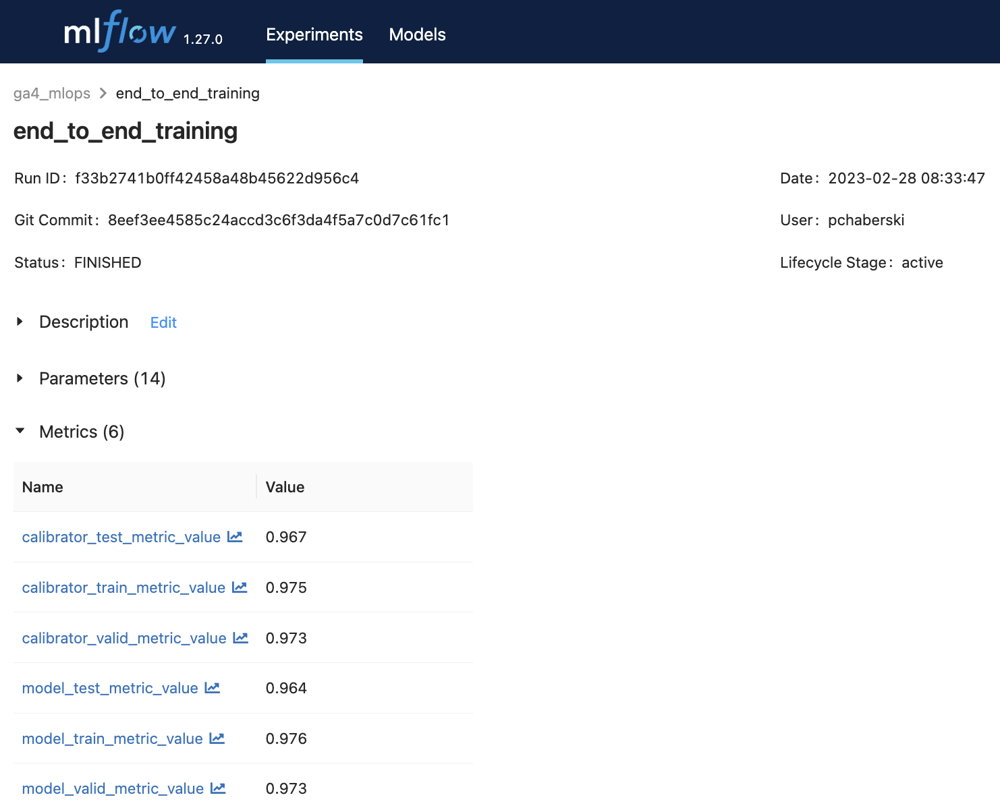
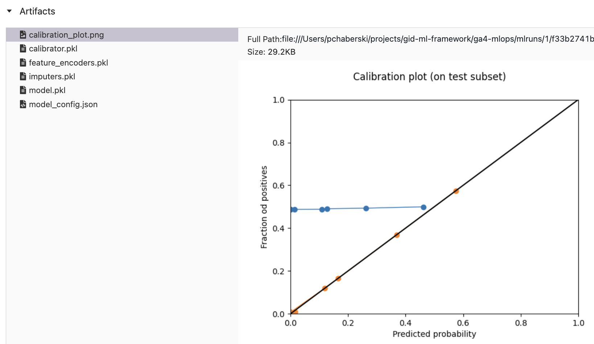
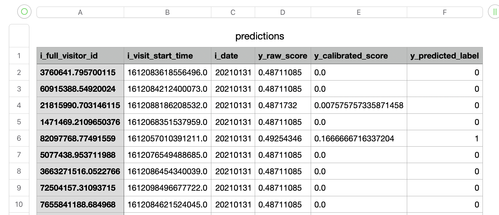
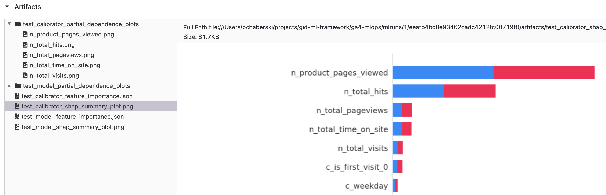
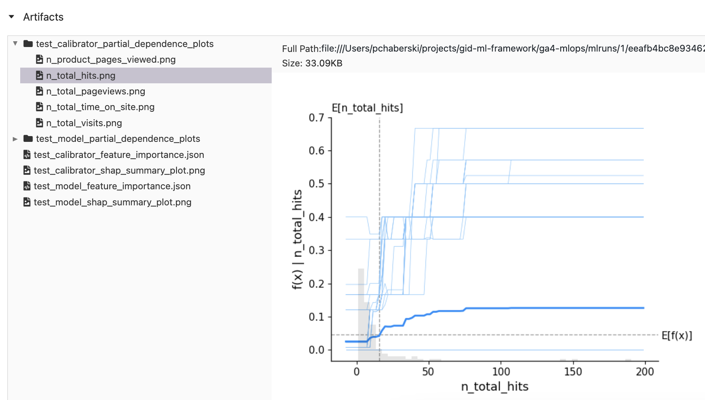
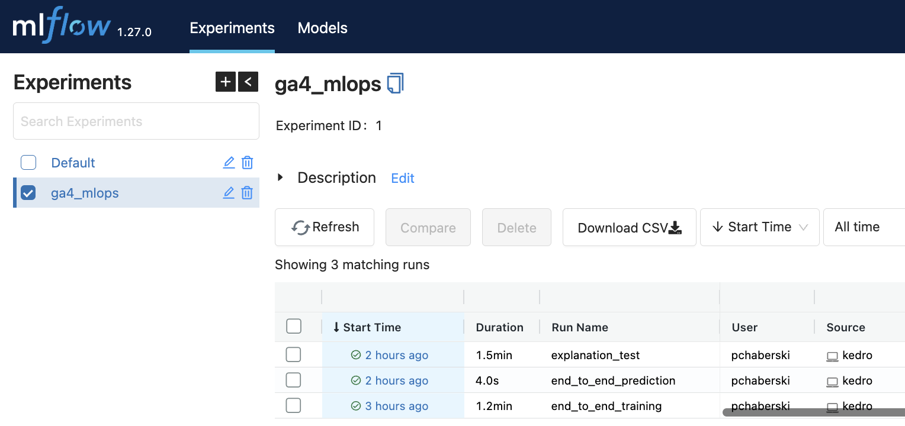
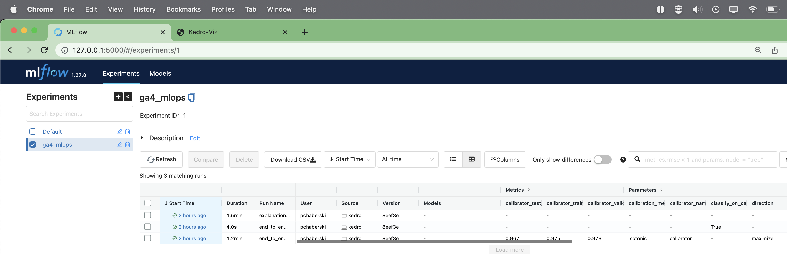
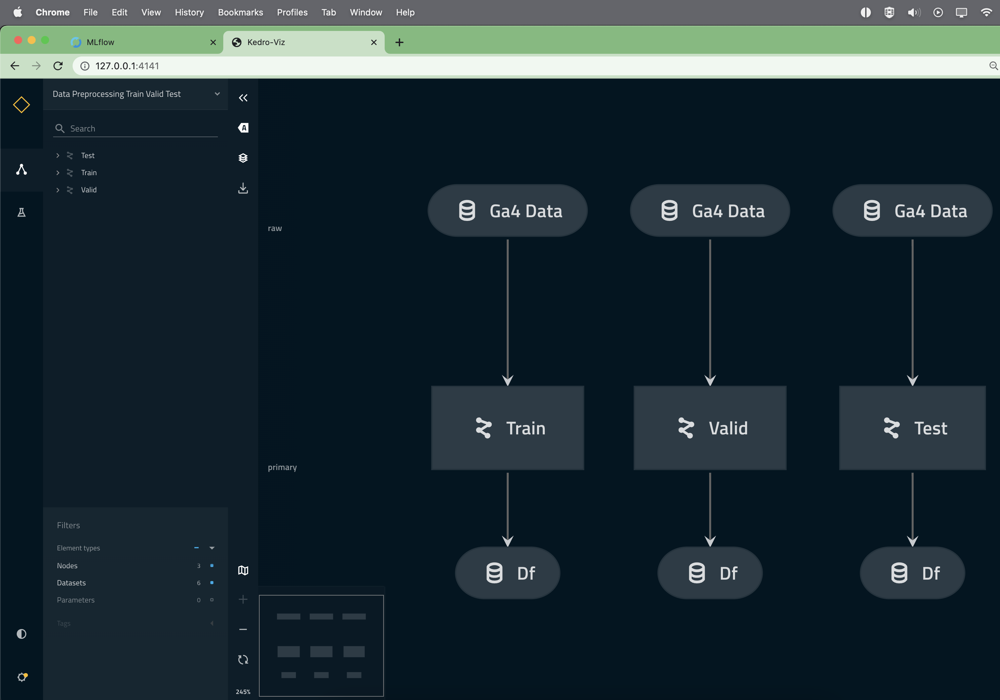

#   Propensity model on Google Analytics 4 data with classification algorithms

## Overview

This GID ML Framework use case is supposed to serve as a basic example of a typical straightforward application of a ML model to some customer or user data that is gathered on a constant basis and collected as daily snapshot of user activity. This particular showcase features predicting the probability of a customer to add a product to a shopping cart during a session on the site and it is based on [Google Analytics](https://analytics.google.com/analytics/web/provision/#/provision) data. From the perspective of modeling approach this example can be easily translated to other problems, especially in **customer analytics area**, that involve estimating propensity to take some action based on the behavior, e.g.:

- churn prediction in telco,
- propensity-to-buy models in e-commerce,
- probability of default in banking,
- and many more.

This blueprint also shows example how to cover if your solution:
- data extraction with parametrized SQL queries and Kedro data catalog
- missing data imputation
- feature encoding
- automated hyperparameter optimization
- probability calibration
- selected model explanations with SHAP values

## Business context

Google Analytics is a popular web service used by companies to get insights about the traffic on their websites. It offers dashboarding capabilities out-of-the box which can be helpful to quickly get some insights, but much more can be done when we access the underlying data directly and apply advanced analytics, headed by machine learning, on our own.

The example presents using a sample data from the newest iteration of the tool (Google Analytics 4) to predict **the probability of adding an item to the shopping cart during an online user session based on the data gathered during that session**.

Full business potential of such model could be revealed in the online inference setup in which the batch-trained model would be served to compute predictions in real time. This way, some other mechanisms could developed on top of propensity prediction that would automatically take some actions (e.g. presenting some additional incentives to the user) during the ongoing session. The basic example that we provide includes only batch scoring on sessions data that were already collected in daily snapshots, so it doesn't support real time actions, however it is still valuable in many ways:

- it shows batch training and scoring workflows that can be easily translated to different business problems and datasets, especially in customer analytics area
- even when your ultimate goal is to deploy the model for online inference, you will still need to implement pipelines in batch version to be able to evaluate your model
- batch scoring is also the basis for explaining the model using eXplainable AI technique
- thanks to keeping solution modular transforming inference pipeline into online inference version is pretty straightforward if data engineering mechanisms are ready for this type of deployment

We plan to include an online inference demo on data streams as an extension of this use case in the future.

## Data

This blueprint is using the [Google Merchandise Store dataset](https://developers.google.com/analytics/bigquery/web-ecommerce-demo-dataset) that is built with [Google Analytics 4](https://developers.google.com/analytics/devguides/collection/ga4) standard and is publicly available to use and explore. Data schema is available [here](https://support.google.com/analytics/answer/7029846?hl=en).

Usually, when you work with GID ML Framework on a use case that relies on some big datasets, we recommend to sample your data and save it either locally or in some database, then use these smaller data samples for initial phase of prototyping to speed up development. With Google Analytics 4 (GA4) data sampling and extracting raw data outside the original BiqQuery storage would be inefficient. GA4 data is divided into separate events that happen during user session and also data schema uses BigQuery specific nested structures that would need to be converted into a flat table before extraction. This would make data export unnecessarily large and push initial aggregations from efficient BiqQuery engine to limited-memory Python environment which is definitely not optimal. Instead, **the first step of the workflow is the Data Preprocessing pipeline, which runs an SQL query that triggers data aggregation and sampling within BigQuery** and then extracts already preprocessed data. For the user this means three things:

- you don't need to download or prepare a data sample by yourself to start local development,
- but you need to configure your Google Cloud account and create a GCP project to access the data, even if you plan to run the rest of the workflow locally or using other cloud provider's infrastructure,
- and also there is no need to having multiple [Kedro environments](https://kedro.readthedocs.io/en/stable/kedro_project_setup/configuration.html) for local or cloud setting; only `base` Kedro environment is being used.

To set up your Google Cloud project: <a name="gcp_setup"></a>

1. Create a [GCP](https://cloud.google.com/) account and install [`gcloud` command line interface](https://cloud.google.com/sdk/gcloud)

2. Log in to your account using `gcloud` from your local machine, from Dev Container or from any other environment that you work on:
```bash
 gcloud auth login --update-adc
```

3. Create a new GCP project and set it up as a working project with `gcloud`:
```bash
gcloud config set project <your_gcp_project_name>
```

For just downloading and using GCP's public data the last step is not mandatory, but if the project is not set you will get a lot of annoying warnings about GCP not being able to determine quota for your data processing.

## Nodes and Pipelines

`ga4_mlops` use case currently consists of 5 main steps that include concrete pipelines:
- Data Preprocessing
- Feature Engineering
- Training
- Prediction
- Explanation

The order of running those parts for the first time should be pretty straightforward given the names. All the pipelines are linked with each other with:

- datasets that are stored in project's directory,
- artifacts and metadata stored in MLflow,
- configuration files including Kedro's data catalog,

which means for example that once you perform Data Preprocessing and Feature Engineering, you can use artifacts that they produce to run Training multiple times to iterate towards the best model. Details of each workflow parts and the concrete pipelines that can be run (check out the [pipeline registry - TO BE UPDATED]() for this Kedro project)are listed and explained below.

There are also some common auxiliary functions abstracted outside pipelines folders and gather within two files:
- `data_preparation_utils.py`, which contains functions for extracting column names based on naming convention, ensuring data types or correcting variable names to contain only allowed characters,
- `modeling_utils.py` that contain at the moment a generic function to score a given preprocessed and engineered dataset with a given ML model.

### Data Preprocessing

Data Preprocessing step consists of only one pipeline in four different versions that preprocess different subsets:
- `data_preprocessing_train` - for training data 
- `data_preprocessing_valid` - for validation data
- `data_preprocessing_test` - for testing data unseen during training
- `data_preprocessing_predict` - for new data used in batch inference

To run Training step you always need to have training, validation and test data, so there is another aggregate pipeline `data_preprocessing_train_valid_test` for convenience. It just runs sub-pipelines for three subsets consecutively.

Each version of the pipeline has only one node that is common for all of them - `get_and_aggregate_data` - that is parametrized with `ga4_data` parameter. `ga4_data` parameter is the identifier of [Kedro Data Catalog](https://kedro.readthedocs.io/en/stable/data/data_catalog.html) abstractions for different subsets which are organized using ["namespace" feature of Kedro modular pipeline](https://kedro.readthedocs.io/en/stable/nodes_and_pipelines/modular_pipelines.html?highlight=namespace), which means that in Data Catalog (`catalog.yml` file in `conf/base`) there are 4 versions of `ga4_data` entry with `train`, `valid`, `test` and `predict` prefixes.

The `get_and_aggregate_data` node is just a wrapper around an SQL query that can be found in `src/ga4_mlops/pipelines/data_preprocessing/sql` folder. This query, thanks to the Kedro's `pandas.GBQQueryDataSet` dataset abstraction, aggregates, samples and stores the data as Pandas Data Frame, and later, thanks to another Kedro abstraction (`pandas.CSVDataSet`), saves this data in `data` folder (which contents are added to `.gitigonre`) as CSV files. **Each versions of the query is parametrized** within `catalog.yml` with 3 parameters:
- `start_date` - the date of the snapshot that opens the sampling window
- `end_data` - the date of the snapshot that closes the sampling window
- `sample_size` - number of records to sample randomly from a collection of snapshots

The values of above parameters should be adjusted in `catalog.yml` before running any of `data_preprocessing_*` pipelines to get data from needed period and of a given size.

Within SQL query there is also a **strict naming convention** implemented, that should be kept throughout the entire processing workflow and when adding or modifying existing columns or model variables. All columns, starting from the results of `data_preprocessing_*` pipelines, follow the single-letter prefixes rules that are essential for further variable interpretations:
- `i_*` prefix denotes informative-only columns like for example user IDs, that are not used in modeling
- `n_*` denotes columns that will become numerical variable
- `c_*` denotes columns that will become categorical variables
- `y_*` denotes target variable (there should be always only one such columns in the dataset)

Produced data frames are saved as CSV in Primary data layer (`data/03_primary` folder).

### Feature Engineering

Analogously to `data_preprocessing_*` pipelines, Feature Engineering step is also divided by subset, so there are 4 versions of `feature_engineering_*` pipeline with `train`, `valid`, `test` and `predict` suffixes, supplemented with aggregate `feature_engineering_train_valid_test` pipeline. Unlike Data Preprocessing, there are some differences in `train` version of the Feature Engineering pipeline compared to other versions. It results from the fact of using `scikit-learn` based imputer and feature encoder objects, that in `valid`, `test` and `predict` pipelines are only applied, but for that to be possible the have to be first fit within `train` pipeline on the training subset.

Feature Engineering pipelines are divided into 4 sub-steps:
- Manual Feature Engineering (implemented as `engineer_features` node) that is a set of user-defined transformations of original columns that create derivative features out of a set of original columns coming from Data Preprocessing step (for example the start hour of the user session derived from event timestamp)
- Manual Feature Exclusion (implemented as `exclude_features` node) to provide the possibility of excluding some features from the dataset during prototyping phase. The list of features is passed as a parameter.
- Missing Values Imputation (implemented as `fit_imputers` and `apply_imputers` nodes) to impute missing values in user-defined manner, also depending on variable type (possible options: mean or zero imputation for numerical variables, most frequent value or dummy label imputation for categorical variables). Imputers are fitted on the training subset and applied on all subsets. Imputation strategies are passed as a dictionary, where for each imputation strategy a list of variables is provided.
- Categorical Features Encoding (implemented as `fit_encoders` and `apply_encoders` nodes) that is responsible for encoding categorical variables using 3 different possible approaches: binary encoding for two-category variables, one-hot encoding or integer (ordinal) encoding for multiple-category variables. Similarly to Imputation steps, encoders are fitted to training subset and then applied to all subsets, types of imputation are also defined and passed as a dictionary of variable lists.

Above mentioned parameters (list of features for exclusion, imputation strategies and encoder types) should never be hardcoded but controlled using `feature_enginering.yml` parameter set dedicated for Feature Engineering pipelines that can be found in `conf/base/parameters` folder.

Data frames produced in Feature Engineering step are saved in Model Input data layer (`data/05_model_input` folder) as CSV. Since they contain already prepared data that is directly fed to the model, they are referred to as "ABTs" (Analytical Base Tables).

Other artifacts (fitted imputers and encoders) are saved in MLFlow using `kedro_mlflow.io.artifacts.MlflowArtifactDataSet` dataset abstraction.

Please note, that there are two versions of `imputers` and `encoders` objects that can be found in data catalog (`conf/base/catalog.yml`):
- `fitted` - that exist in memory and can be used during current pipeline run (eventually they are also saved for further use in MLflow registry),
- `stored` - that are loaded from MLflow and were fitted and saved by some other pipeline run that the current one.

This distinction is practically used in the following way:
- in `feature_engineering_train_valid_test` pipeline that is a part of End to End procedure, imputers and encoders are first fitted to the `train` subset, and then they are immediately applied to `train`, `valid` and `test` subsets
- in `feature_engineering_predict` pipeline uses stored imputers and encoders, that were saved during one of previous runs of a pipeline that involved fitting them on a training subset.

To use `stored` versions of imputers or encoders, in Data Catalog user needs to provide an additional parameter `run_id` within `_stored_modeling_artifacts_args` group, which is a MLflow Run ID of the run that produced these artifacts.

### Training

Training procedure currently uses XGBoost model which hyperparameters are optimized using [Optuna](https://optuna.org/) package. In short, the optimization procedure takes training subset, fits many models within given time limit and chooses the best set of hyperparameters based on validation subset. Then, the final model with the best hyperparameters is trained and stored in MLflow. Also, since XGBoost produces uncalibrated scores, there is also [probability calibration](https://scikit-learn.org/stable/modules/calibration.html) step added which involves fitting and storing a calibrator model using selected method (either logistic regression or isotonic regression).

Full Training procedure can be divided into two sub-pipelines: `training_pipeline` and `evaluation_pipeline`, the other being applied to 3 subsets: `train`, `valid` and `test` to calculate final performance metrics (AUC by default) that can help to assess model performance and overfitting tendency. Together the make `training_and_evaluation_pipeline` with the following component nodes:
- `optimize_xgboost_hyperparameters` that runs hyperparameter optimization procedure and chooses the best hyperparameters based on the evaluation metric
- `train_xgboost_model` that takes best hyperparameters and trains final main XGBoost model
- `fit_calibrator` that fits calibrator model on a test set (test set is used as a subset that is not involved in training the main model in any way to avoid overfitting)
- `create_calibration_plot` that additionaly calculates [calibration curves](https://scikit-learn.org/stable/modules/calibration.html#calibration-curves) for the main model and the calibrator
- `evaluate_model` that calculates evaluation metrics for both models on all subsets
- `log_metric` that saves evaluation metrics to MLflow

Note that the last two nodes are executed in total six combinations of subset and model: for three different subsets (`train`, `valid` and `test`) and for two models (base XGBoost model referred to as `model` and calbration model referred to as `calibrator`).

Also, similarly as with imputers and encoders, Data Catalog includes two versions of main model and calibrator model: `fitted` and `stored`. The first, being stored in-memory during the run and saved in MLflow at the end, is used during models evaluation phase, and the other is used in Prediction pipeline to make predictions on new data with previously trained model. To use `stored` version of the model during prediction the same MLflow Run ID as for imputers and encoders is passed through `catalog.yml` as `run_id` parameter. If you have not fitted your encoders and imputers along with your model and calibrator within the same end to end run and they have different MLflow Run IDs, you can always overwrite this common [YAML anchor](https://medium.com/@kinghuang/docker-compose-anchors-aliases-extensions-a1e4105d70bd) by passing different `run_ids` directly to appropriate artifact abstractions definitions in Data Catalog.

Hyperparameter space to search through is defined within `optimize_xgboost_hyperparameters` (hardcoded) as it something algorithm-specific. Other parameters related to model training (like for example evaluation metric or optimization procedure time limit) can be modified through `training.yml` configuration file in `conf/base/parameters` folder. There is also a bunch of parameters that are just name aliases that help to define the pipeline itself in a more compact way (`train_name`, `model_name` etc.) - there should be no need to change them.

Training pipeline produces multiple MLflow artifacts that can be found in Data Catalog in `# MODELS` section:
- `model` - main XGBoost model (note that besides `stored` Data Catalog entry for MLflow artifact there is also `fitted` version for in-memory use)
- `calibrator` - calibration model that uses either logistic or isotonic regression
- `model_config` - JSON file with all XGBoost hyperparameters from the final model
- `calibration_plot` - a chart of calibration curves for the main model and the calibrator

Example of model metrics in MLflow:



Example of calibration curves in MLflow:



### Prediction

Prediction pipeline is pretty straightforward and consists of 3 nodes:
- two consecutive `score_abt` nodes that score given prediction Analytical Base Tables (`predict.abt` from Data Catalog) with main model and calibration model, respectively
- `create_predictions` node that that takes both raw scores (from main model) and calibrated scores and prepares final data frame with predictions for each observation that in addition to info columns and mentioned scores contains predicted class label. Class label is assigned based on selected set of scores (raw or calibrated) and the classification threshold. Those two parameters (`classify_on_calibrated` and `threshold`) should be provided via `prediction.yml` config file in `conf/base/parameters` folder

Note that `score_abt` is abstracted out of `nodes.py` file into `modeling_utils.py` file one level above in the folder structure, so it doesn't belong to any pipeline. This is because right now at least two pipelines (not only `prediction`, but also `training` in model evaluation phase) make use of this function. This node is also designed to be model agnostic for the future extensions of the use case involving algorithms other than XGBoost - it can take any model that contain `predict_proba` method that works in a `scikit-learn`-like way.

The results of Prediction pipeline (the table with scores and predicted labels) are saved as CSV in Model Output layer (`data/07_model_output` folder).

Example of models' predictions:



### Explanation

This pipeline uses some of the global [XAI](https://christophm.github.io/interpretable-ml-book/) (currently with [SHAP](https://shap.readthedocs.io/en/latest/index.html) values and Partial Dependence Plots). There are three versions of Explanation pipeline registered in `pipeline_registry.py` for each of the subset that contains ground truth variable: `train`, `valid` and `test`. Also, all explanations are each time calculated for both models - the main model and the calibrator.

Explanation pipeline consists of the following nodes:
- `sample_data` that draws a sample from a given subset that will be used as a representation for creating explanations. Data is sampled in a stratified manner with respect to target variable to preserve class labels proportions
- `calculate_shap` that calculates SHAP values upon which all current explanations are created
- `create_explanations` that creates explanations with given methods. This node gathers all sub-functions that create different types of explanations. Component functions are implemented as separate sub-functions to maintain single responsibility principle

The pipeline is in fact a sum of two sub-pipelines (one for the main model and the other for the calibration model) and is parametrized with `subset` parameter, which allows to register it in three versions in Pipeline Registry, one for each subset from `train`, `valid` and `test`.

Artifacts presenting currently implemented explanations are saved in Reporting layer (`data/08_reporting` folder) and also within MLflow run where they are not being overwritten by further runs unlike the temporary local storage copy. Those artifacts are:
- `shap_summary_plot` - a plot showing the influence of most important variables based on aggregated SHAP values calculated on a data sample of given size taken from a selected data subset
- `feature_importance` - JSON with values of relative importance calculated based on aggregated SHAP values and normalized to sum up to 1
- `partial_dependence_plots` - a folder with Partial Dependence Plots for the given number of most important variables

Explanation pipeline in all its versions for different subsets is controlled by some parameters passed through `explanation.yml` in `conf/base/parameters` folder:
- `n_obs` - the size of the data sample to use for SHAP values calculation. These calculations are quite computationally intensive so be careful with setting large values
- `sampling_seed` - random seed to use when sampling observations for SHAP calculation
- `pdp_top_n` - the number of most important variables to present on Partial Dependence Plots

Example of SHAP Summary Plot in MLflow:



Example of a Partial Dependence Plot in MLflow:



### End to End Procedures

There are two aggregate pipelines to run End to End Training and Prediction procedures that include Data Preprocessing, Feature Engineering and either Training or Prediction. Technically, they are the following sums of component pipelines:

```python
  end_to_end_training_pipeline = (
      data_preprocessing_train_valid_test_pipeline
      + feature_engineering_train_valid_test_pipeline
      + training_pipeline
  )

  end_to_end_prediction_pipeline = (
      data_preprocessing_predict_pipeline
      + feature_engineering_predict_pipeline
      + prediction_pipeline
  )
```

End to End Training pipeline does not include Explanation pipelines, since the explanations are:
- not always required
- computationally intensive
- applicable to `train`, `valid` and `test` subsets

Explanations can be run separately by providing `run_id` parameter in `catalog.yml` that refers to the existing MLflow Run ID of the previously executed Training or End to End Training pipeline and using `explanation_*` pipelines, where `*` is either `train`, `valid` or `test`. Please note that Explanation pipeline will use models loaded from MLflow's given run which are registered and versioned, but **if it comes to datasets, currently they are not versioned**, so the Explanation pipeline will also use the latest version of stored datasets. If there is such need, thanks to modular and additive nature of Kedro pipelines, it is easy to add any additional pipeline to the End to End Training procedure, like for example Explanation pipeline, or just create another custom aggregate pipeline.

**Remember, that both End to End Prediction pipeline and Explanation pipelines rely on MLflow Run ID** provided via Data Catalog's `run_id` parameter in `_stored_modeling_artifacts_args` group, so before running either of them, you need to run End to End Training pipeline first and then copy its MLflow Run ID to the `catalog.yml` file.

Summary of executed End to End pipelines in Mlflow along with Explanation pipeline on `test` subset:



## How to run

To run the example as is, you need to:

1. Create the working environment according to [instructions given in the GID ML Framework documentation - TO BE UPDATED]()

2. Set up GCP project [as shown in "Data" section](#gcp_setup) of this README

3. Run MLflow and optionally Kedro-Viz:
```bash
kedro mflow ui
kedro viz
```

You can run MLflow or Kedro-Viz on a selected port. For Kedro-Viz, you can also visualize only selected pipelines and set up `autoreload` option that refreshes visualizations each time any changes to pipelines are made:

```bash
kedro mlflow ui --port 5001
kedro viz --autoreload --port 4142 --pipeline end_to_end_training
```

4. Run End to End Training and Prediction pipelines along with Explanation pipeline:
```bash
kedro run -p end_to_end_training
# Remember to copy End to End Training Run ID to catalog.yml as run_id parameter before running Prediction or Explanation pipelines!
kedro run -p end_to_end_prediction
kedro run -p explanation_test
```

MLflow summary dashboard after running End to End Training and Prediction followed by Explanation on `test` subset:



Kedro-Viz example presenting Data Preprocessing pipeline for `train`, `valid` and `test` subsets:


